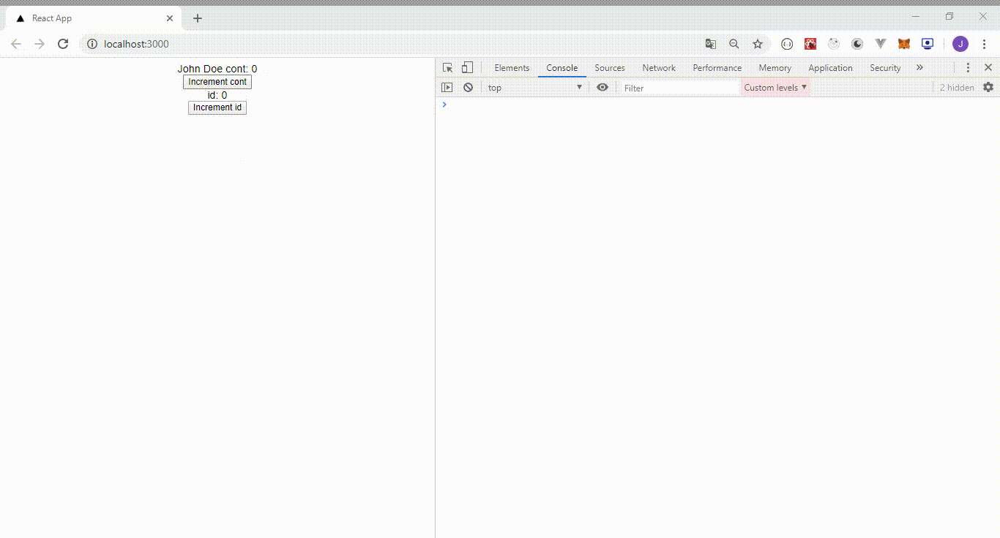

# 17 Why Did You Update

As seen in previous samples, using _React.memo_ higher order component we avoid render a component when same props give the same results. But, what if are you still seeing re-renders that seem unnecessary? You can use a custom hook that allows you to see which props are causing a component to re-render. In this sample we will learn how to implement it.

# Steps

- We will take as starting point sample _00 boilerplate_. Copy the content of the project to a fresh folder and execute _npm install_.

```bash
npm install
```

- Let's open the _demo.js_ file. We will create a parent and a child component. Child component will just display its props while parent component has two state variables displayed and two buttons (these buttons increment variables values);

_./src/demo.js_

```jsx
import React from "react";

export const MyComponent = () => {
  const [cont, setCont] = React.useState(0);
  const [id, setId] = React.useState(0);

  const name = {
    firstname: 'John',
    lastname: 'Doe',
  };

  return(
    <div>
      <div>
        <MyChildComponent name={name} cont={cont} />
        <button onClick={() => setCont(cont + 1)}>Increment cont</button>
      </div>

      <div>
        <div>id: {id}</div>
        <button onClick={() => setId(id + 1)}>Increment id</button>
      </div>
    </div>
  );
};

export const MyChildComponent = React.memo(props => {
  return(
    <div>
      {props.name.firstname} {props.name.lastname} cont: {props.cont}
    </div>
  );
});
```

- Now we have to add our custom hook _useWhyDidYouUpdate_ and use it inside _MyChildComponent_. This hook recieves a component props and checks if these props have changed.

_./src/demo.js_

```diff
import React from "react";

export const MyComponent = () => {
  const [cont, setCont] = React.useState(0);
  const [id, setId] = React.useState(0);

  const name = {
    firstname: 'John',
    lastname: 'Doe',
  };

  return(
    <div>
      <div>
        <MyChildComponent name={name} cont={cont} />
        <button onClick={() => setCont(cont + 1)}>Increment cont</button>
      </div>

      <div>
        <div>id: {id}</div>
        <button onClick={() => setId(id + 1)}>Increment id</button>
      </div>
    </div>
  );
};

export const MyChildComponent = React.memo(props => {
+ useWhyDidYouUpdate('MyChildComponent', props);
  return(
    <div>
      {props.name.firstname} {props.name.lastname} cont: {props.cont}
    </div>
  );
});

+// Hook
+function useWhyDidYouUpdate(name, props) {
+  // Get a mutable ref object where we can store props ...
+  // ... for comparison next time this hook runs.
+  const previousProps = React.useRef();
+
+  React.useEffect(() => {
+    if (previousProps.current) {
+      // Get all keys from previous and current props
+      const allKeys = Object.keys({ ...previousProps.current, ...props });
+      // Use this object to keep track of changed props
+      const changesObj = {};
+      // Iterate through keys
+      allKeys.forEach(key => {
+        // If previous is different from current
+        if (previousProps.current[key] !== props[key]) {
+          // Add to changesObj
+          changesObj[key] = {
+            from: previousProps.current[key],
+            to: props[key]
+          };
+        }
+      });
+
+      // If changesObj not empty then output to console
+      if (Object.keys(changesObj).length) {
+        console.log('[why-did-you-update]', name, changesObj);
+      }
+    }
+
+    // Finally update previousProps with current props for next hook call
+    previousProps.current = props;
+  });
+}
```

> You can just copy this hook from [usehooks.com](https://usehooks.com/useWhyDidYouUpdate/) or install it as a library [whydidyourender](https://github.com/welldone-software/why-did-you-render#readme)

- Run sample to test the hook.

```bash
npm start
```

- If you open the browser's console log, you can see that our custom hook fires a message everytime _Increment cont_ button is clicked. That's the expected behaviour, but when _Increment id_ button is pressed our hook also display a message on console log. Why? Because _name_ variable is inside _MyComponent_ and this component is re-rendered each time the user presses button _Increment id_ (this button updates state variable _id_, and a component state update implies its re-rendering). Re-render provokes the generation of a new _name_ variable.



- Thanks to our custom hook we noticed that _name_ variable should be outside _MyComponent_. If we modify _demo.js_ taking _name_ variable out of parent component, _useWhyDidYouUpdate_ hook only will trigger a console log when _Increment cont_ button is pressed.

_./src/demo.js_

```diff
import React from "react";

+ const name = {
+   firstname: 'John',
+   lastname: 'Doe',
+ };

export const MyComponent = () => {
  const [cont, setCont] = React.useState(0);
  const [id, setId] = React.useState(0);

- const name = {
-   firstname: 'John',
-   lastname: 'Doe',
- };
-
  return(
    <div>
      <div>
        <MyChildComponent name={name} cont={cont} />
        <button onClick={() => setCont(cont + 1)}>Increment cont</button>
      </div>

      <div>
        <div>id: {id}</div>
        <button onClick={() => setId(id + 1)}>Increment id</button>
      </div>
    </div>
  );
};

export const MyChildComponent = React.memo(props => {
  useWhyDidYouUpdate('MyChildComponent', props);
  return(
    <div>
      {props.name.firstname} {props.name.lastname} cont: {props.cont}
    </div>
  );
});
```


# About Basefactor + Lemoncode

We are an innovating team of Javascript experts, passionate about turning your ideas into robust products.

[Basefactor, consultancy by Lemoncode](http://www.basefactor.com) provides consultancy and coaching services.

[Lemoncode](http://lemoncode.net/services/en/#en-home) provides training services.

For the LATAM/Spanish audience we are running an Online Front End Master degree, more info: http://lemoncode.net/master-frontend
